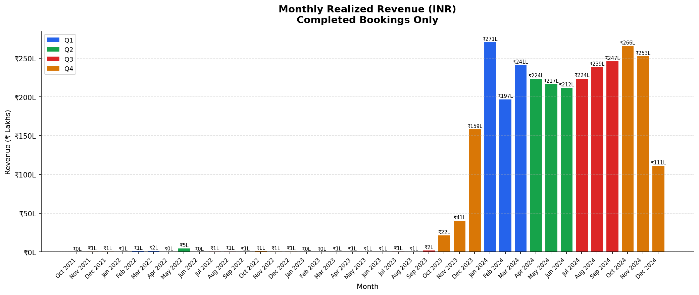
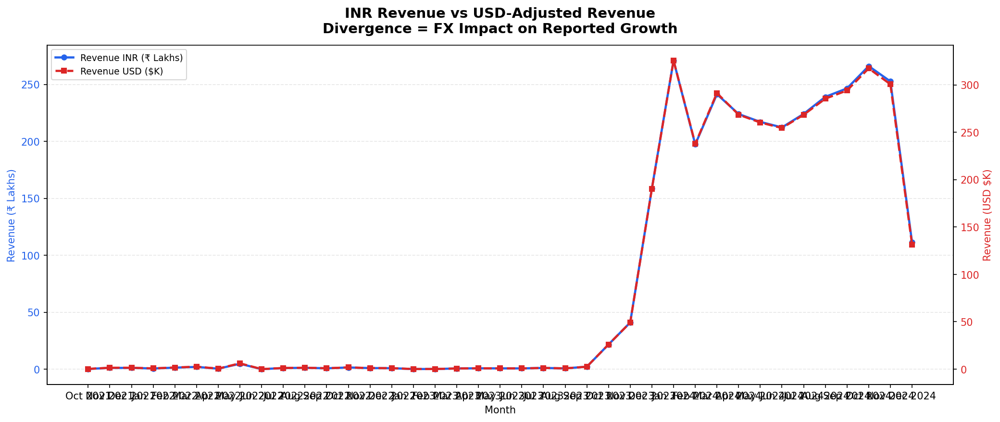

# FX-Adjusted Revenue Analytics

> Separating operational performance from currency noise in multi-currency revenue reporting.

---

## The Business Problem

When a hotel booking platform reports revenue in INR, international stakeholders reading in USD face a fundamental question:

**Is growth being driven by real business performance — or by currency movement?**

This project integrates historical FX data into revenue reporting to answer that question clearly.

---

## What This Project Does

Using a hotel booking dataset and the [Frankfurter Exchange Rate API](https://www.frankfurter.app/), this project:

- Filters for **completed bookings only** (realized revenue)
- Aggregates **monthly INR revenue**
- Fetches **historical INR → USD rates** per reporting period
- Compares **local-currency growth vs. FX-adjusted growth**
- Generates **executive-level business insights**

The result: a clean view of whether revenue trends reflect operations or currency shifts.

---

## Project Workflow

```
Hotel Booking Data
        │
        ▼
Data Cleaning & Validation
        │
        ▼
Completed Bookings Filter
        │
        ▼
Monthly Revenue Aggregation (INR)
        │
        ▼
Frankfurter FX API Integration
        │
        ▼
Historical INR → USD Conversion
        │
        ▼
Revenue Comparison & Trend Analysis
        │
        ▼
Business Insight Generation
```

---

## Key Results

| Metric | Value |
|---|---|
| Total Realized Revenue | ₹29.49 Crore |
| USD-Equivalent Revenue | ~$3.24 Million |
| INR Depreciation (Active Period) | 1.83% |
| Estimated FX Drag | ~$12,800 |
| FX Impact on Revenue | 0.40% |

**Conclusion:** Operational improvements drove performance. FX drag was minimal and well within noise.

---

## Non-Obvious Finding

Between January 2024 and October 2024:

- Booking volume **fell 16.5%**
- Total revenue remained **nearly flat**
- Revenue per booking **increased 17.6%**

Growth was driven by improved pricing efficiency and customer value — not volume. This is not visible without separating volume and rate effects.

---

## Visualizations

### Monthly INR Revenue Trend


Revenue consistently exceeded ₹200 Lakhs across multiple periods in 2024.

### INR vs. USD-Adjusted Revenue


INR revenue growth outpaced USD-adjusted growth — confirming mild FX drag, not operational weakness.

---

## API Integration

Historical exchange rates are pulled from the [Frankfurter API](https://www.frankfurter.app/) using period-specific dates:

```http
GET https://api.frankfurter.app/2024-06-01?base=INR&symbols=USD
```

Using historical rates (not current rates) ensures accuracy for each reporting period.

---

## Tech Stack

- Python, Pandas, NumPy
- Matplotlib
- Requests
- Jupyter Notebook
- Frankfurter REST API
- Git & GitHub

---

## Project Structure

```
fx-adjusted-revenue-analytics/
│
├── outputs/
│   ├── chart_1_inr_revenue_trend.png
|   ├── monthly_revenue_with_fx.csv
│   └── chart_2_usd_vs_inr_trend.png
│
├── multi_currency_revenue_reporter.ipynb
├── Project Insight.docx
├── AI_USAGE_NOTE.txt
├── requirements.txt
├── LICENSE
└── README.md
```

---

## Getting Started

```bash
# Clone the repo
git clone https://github.com/ommishra03/fx-adjusted-revenue-analytics.git
cd fx-adjusted-revenue-analytics

# Install dependencies
pip install -r requirements.txt

# Launch the notebook
jupyter notebook multi_currency_revenue_reporter.ipynb
```

---

## Roadmap

- [ ] Multi-currency support (EUR, GBP)
- [ ] Interactive Streamlit dashboard
- [ ] FX-adjusted revenue forecasting
- [ ] Currency sensitivity scenario analysis

---

## Author

**Om Mishra** — Business Analytics | Data Analytics | AI & ML

[](https://www.linkedin.com/in/om-mishra-a62991289)
[](https://github.com/ommishra03)
